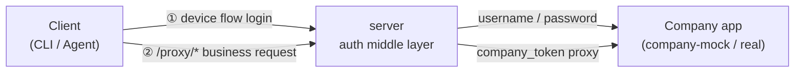

# auth-proxy

[](https://github.com/renxqoo/auth-proxy/actions/workflows/build.yml)
[](https://github.com/renxqoo/auth-proxy/actions/workflows/deploy.yml)
[](./LICENSE)
[](https://nodejs.org)
[](https://pnpm.io)
[](./CONTRIBUTING.md)

**English** · [中文](./README.zh-CN.md)

OAuth 2.0 device-flow authentication proxy. Issues RS256 JWTs and proxies requests to your company's apps — **company credentials never leave the proxy**. Clients only ever hold a JWT minted by the middle layer; the company token (`ct_*`) stays internal.



Two links: **① login** (device flow → client gets a JWT) and **② proxy** (business request → server forwards it on the company's behalf).

---

## Table of Contents

- [Features](#features)
- [Tech Stack](#tech-stack)
- [Architecture](#architecture)
- [Quick Start](#quick-start)
- [API Endpoints](#api-endpoints)
- [End-to-End Flow](#end-to-end-flow)
- [Admin Console](#admin-console)
- [Deployment](#deployment)
- [Operations](#operations)
- [Security Design](#security-design)
- [Development](#development)
- [Connecting the Real Company App](#connecting-the-real-company-app)
- [Contributing](#contributing)
- [License](#license)

## Features

- 🔐 **Device-flow auth (RFC 8628)** — ideal for CLIs and headless agents; no browser redirect needed on the client.
- 🛡️ **Company credentials never exposed** — the company token (`ct_*`) lives only inside the proxy; clients get a proxy-minted JWT.
- 🔑 **JWT RS256 with rotatable signing keys** — public key published at `/.well-known/jwks.json`; keys stored in the `signing_keys` table.
- 🔄 **Refresh-token rotation + reuse detection** — replaying an old refresh token past the grace window auto-revokes the session.
- 🧮 **Rate limiting** (Redis-backed) — per-IP on login, per-client on `/token`, per-session on `/proxy`.
- 🛡️ **CSRF protection**, scrypt-hashed secrets, production config validation, strong-random first admin.
- 📊 **Audit log** — login attempts (incl. `[REUSE]` replay events) and every proxied API call.
- 🖥️ **Admin console** (Next.js) — manage registration tokens, clients, admins, and view audit logs.
- 🐳 **One-command deploy** — `deploy.sh` or GitHub Actions CI/CD with GHCR image distribution.
- 🗄️ **Automated ops** — daily Postgres backups + health-check cron installed on deploy.

## Tech Stack

| Layer | Technology |
|-------|------------|
| Middle layer (`apps/server`) | [Hono](https://hono.dev) 4, [jose](https://github.com/panva/jose) 6 (JWT/JWKS), TypeScript 5 |
| Admin console (`apps/admin-web`) | [Next.js](https://nextjs.org) 16, React 19, Tailwind CSS 4, shadcn/ui |
| Shared contracts (`packages/shared`) | [zod](https://zod.dev) 4 |
| Database (`packages/db`) | PostgreSQL, [drizzle-orm](https://orm.drizzle.team) 0.44, drizzle migrations |
| Cache / rate-limit / device-code store | Redis |
| Monorepo | pnpm 11 workspaces + [Turborepo](https://turbo.build) 2 |
| Lint / Format | oxlint + oxfmt |
| Test | Vitest |
| Deployment | Docker, docker-compose, nginx, GitHub Actions |

## Architecture

Monorepo managed with **pnpm workspaces + Turborepo**.

| Package | Responsibility | Port |
|---------|----------------|------|
| `packages/shared` | zod contracts + shared types | — |
| `packages/db` | DB schema (drizzle) + migrations + seed | — |
| `apps/company-mock` | Mock company app (`/login` `/refresh` `/me` `/api/orders`) | 4000 (internal) |
| `apps/server` | Auth middle layer: device flow + login page + JWT + gateway | 3000 (internal) |
| `apps/admin-web` | Admin console (Next.js) | 3001 (internal) |

**Database tables:** `signing_keys`, `apps`, `users`, `sessions`, `login_logs`, `api_logs`, `refresh_token_history`, `registration_tokens`, `admins`.

### Deployment topology

Only **nginx** is exposed on port 80; every other service lives on the internal network.

```
public :80 ──► nginx ──┬──► server:3000     (middle layer API + login page)
                       └──► admin-web:3001   (admin console, /admin)
server ──► postgres / redis / company-mock   (internal network only)
```

Full deployment diagrams and rationale: [docs/docker](./docs/docker/README.md).

## Quick Start

### Prerequisites

- **Node 22+**, **pnpm 11** (auto-enabled via corepack)
- **Postgres** and **Redis** (installed locally, or boot them with `docker compose up -d postgres redis`)

### Initialize

```bash
pnpm install

# Boot PG + Redis (skip if already running locally)
docker compose up -d postgres redis

# Create the database + run migrations + seed (generates RSA keys + first admin)
createdb auth-proxy
DATABASE_URL=postgres://localhost:5432/auth-proxy pnpm --filter @auth-proxy/db migrate
DATABASE_URL=postgres://localhost:5432/auth-proxy \
  ADMIN_USERNAME=admin ADMIN_PASSWORD=devpassword123 \
  pnpm --filter @auth-proxy/db seed

# Start mock + middle layer
DATABASE_URL=postgres://localhost:5432/auth-proxy \
REDIS_URL=redis://localhost:6379/2 \
COMPANY_API_BASE=http://localhost:4000 \
ADMIN_SESSION_SECRET=dev_secret_change_me_at_least_32_bytes_long \
  pnpm dev:all
```

The first admin account is created by the seed using `ADMIN_USERNAME` / `ADMIN_PASSWORD`. After logging into the console you can mint **registration tokens** to hand out to clients.

> **Note:** in production the seed creates **no** admin (zero defaults, no weak passwords). Create the first admin manually with `pnpm --filter @auth-proxy/db create-admin` or `docker compose exec server node packages/db/dist/scripts/create-admin.js`.

## API Endpoints

All endpoints are served by the middle layer (`apps/server`), rooted at the server base URL (e.g. `http://localhost:3000`).

### OAuth 2.0 device flow (RFC 8628)

| Method | Path | Description |
|--------|------|-------------|
| `POST` | `/register` | RFC 7591 dynamic client registration (`client_metadata` → `client_id` + `client_secret`) |
| `GET` | `/authorize` | RFC 6749 §4.1.1 authorization endpoint (authorization_code + PKCE S256) |
| `POST` | `/device_authorization` | Request a device code → returns `device_code`, `user_code`, `verification_uri` |
| `POST` | `/token` | Token issuance: `authorization_code` (PKCE), `device_code`, or `refresh_token` grant |
| `GET` | `/verify` | Login page the user opens in a browser (accepts `?user_code=`) |
| `POST` | `/verify/login` | Submit company username/password to authorize the device |
| `GET` | `/user_info` | Get current session info (bearer access token) |
| `POST` | `/revoke` | Revoke a session/token |
| `GET` | `/.well-known/jwks.json` | Public JWT signing keys (RS256) |
| `GET` | `/.well-known/oauth-authorization-server` | RFC 8414 metadata (issuer, endpoints, grants, PKCE methods, scopes) |

### Proxy gateway

| Method | Path | Description |
|--------|------|-------------|
| `ALL` | `/proxy/*` | Forward any request to the company app using the stored company token. Strip `/proxy` prefix; pass through status + body. |

### Admin API (`/admin/web/*`)

Session-cookie auth, consumed by the admin console. Includes `/login`, `/logout`, `/me`, `/overview`, `/tokens`, `/apps`, `/audit/login`, `/audit/api`, `/admins`. See [`apps/server/src/routes/adminWeb.ts`](./apps/server/src/routes/adminWeb.ts).

## End-to-End Flow

How a CLI/agent authenticates and calls a company API:

```
┌─────────┐                    ┌─────────┐                  ┌─────────────┐
│  Client │                    │ server  │                  │ Company app │
│ (CLI)   │                    │ (proxy) │                  │ (mock/real) │
└────┬────┘                    └────┬────┘                  └──────┬──────┘
     │  ① POST /register            │                              │
     │ ────────────────────────────►│                              │
     │  ◄── client_id, client_secret│                              │
     │                              │                              │
     │  ② POST /device_authorization│                              │
     │ ────────────────────────────►│                              │
     │  ◄── device_code, user_code, │                              │
     │      verification_uri        │                              │
     │                              │                              │
     │  ③ Open verification_uri     │                              │
     │     in browser, login ───────┼─────────────────────────────►│ (username/pass)
     │                              │  ◄── company_token (ct_*) ───┤  never leaves proxy
     │                              │                              │
     │  ④ POST /token (poll)        │                              │
     │ ────────────────────────────►│                              │
     │  ◄── access_token (JWT)      │                              │
     │      refresh_token           │                              │
     │                              │                              │
     │  ⑤ POST /proxy/api/orders    │                              │
     │      Authorization: Bearer … │                              │
     │ ────────────────────────────►│── company_token ────────────►│
     │                              │◄──────── response ───────────┤
     │  ◄── 200 + body (passthrough)│                              │
```

Minimal client example (HTTP), once you have `client_id` / `client_secret` from `/register`:

```bash
# ① request device code
curl -X POST http://localhost:3000/device_authorization \
  -u "$CLIENT_ID:$CLIENT_SECRET"

# → { "device_code":"…", "user_code":"ABCD-WXYZ",
#     "verification_uri":"http://localhost:3000/verify",
#     "verification_uri_complete":"http://localhost:3000/verify?user_code=ABCD-WXYZ",
#     "expires_in":600, "interval":5 }

# ② user opens verification_uri_complete in a browser and logs in

# ③ poll for token (respect `interval`, handle authorization_pending / slow_down)
curl -X POST http://localhost:3000/token \
  -u "$CLIENT_ID:$CLIENT_SECRET" \
  -d "grant_type=urn:ietf:params:oauth:grant-type:device_code" \
  -d "device_code=$DEVICE_CODE"

# → { "access_token":"eyJ…", "token_type":"Bearer",
#     "expires_in":3600, "refresh_token":"…", "scope":"…" }

# ④ call the company API through the proxy
curl http://localhost:3000/proxy/api/orders \
  -H "Authorization: Bearer $ACCESS_TOKEN"
```

## Admin Console

Local: `http://localhost:3001/admin` · Production: `http://<server>/admin`

Features (username/password login + session-cookie auth):

- **Registration tokens** — create (time-limited, multi-use) / list (with usage counts) / revoke
- **Clients** — list all dynamically registered clients / revoke / restore
- **Audit log** — login attempts (success/failure + `[REUSE]` replay events) and API call records
- **Admins** — add / remove (you can't delete yourself)

## Deployment

**Daily deployments run through GitHub Actions CI/CD** (recommended):

- Push to `main` → [`.github/workflows/build.yml`](./.github/workflows/build.yml) builds the three images and pushes them to GHCR.
- Manually trigger [`.github/workflows/deploy.yml`](./.github/workflows/deploy.yml) to deploy (SSH to the server, pull the latest image, restart). Required Secrets: `DEPLOY_HOST` / `DEPLOY_USER` / `DEPLOY_SSH_KEY` (`DEPLOY_PORT` optional). Required input: `public_base_url`.

**Emergency manual deploy** (only when CI/CD is unavailable, e.g. GitHub outage):

```bash
PUBLIC_BASE_URL=http://<public-ip> SSH_HOST=<server-ip> ./deploy.sh
RESTART_ONLY=1 SSH_HOST=<server-ip> ./deploy.sh                              # just restart containers
FORCE_NEW_SECRETS=1 PUBLIC_BASE_URL=http://<public-ip> SSH_HOST=<server-ip> ./deploy.sh  # regenerate machine secrets
```

`deploy.sh` pre-builds artifacts locally (to avoid OOM on low-spec servers), uploads them, then the server only assembles runtime deps + copies artifacts (no compilation).

After deployment:

- Middle layer: `http://<server>/`
- Admin console: `http://<server>/admin/login`
- JWKS: `http://<server>/.well-known/jwks.json`

### Required environment variables

Production `.env` is generated automatically by `deploy.sh` on first deploy. Full reference: [`.env.example`](./.env.example).

| Variable | Description |
|----------|-------------|
| `DATABASE_URL` | Postgres connection string |
| `REDIS_URL` | Redis connection string (use an isolated db index, e.g. `/2`) |
| `ADMIN_SESSION_SECRET` | Admin session-cookie signing key (≥32 bytes; enforced in production) |
| `ADMIN_USERNAME` / `ADMIN_PASSWORD` | First admin credentials (seed creates them only when the table is empty) |
| `POSTGRES_PASSWORD` | Database password |
| `PUBLIC_BASE_URL` | Publicly reachable address used to build `verification_uri` (guards against host-header injection) |
| `COMPANY_API_BASE` | Company app base URL (change this to connect the real app) |

## Operations

`deploy.sh` auto-installs a cron (`/etc/cron.d/auth-proxy`):

- **Daily 03:00** — Postgres backup → `/opt/backups/postgres/` (14-day retention)
- **Every 5 min** — health check → fires a webhook on failure (30-min debounce)

```bash
# Manual backup / restore
/opt/auth-proxy/ops/backup.sh
/opt/auth-proxy/ops/restore.sh --list
/opt/auth-proxy/ops/restore.sh /opt/backups/postgres/auth-proxy_XXXXXXXX.sql

# Off-site backup + alerting (configured via .env)
REMOTE_BACKUP_CMD="rclone copyto {} oss:auth-proxy-backup/{/}"
ALERT_WEBHOOK=https://open.feishu.cn/open-apis/bot/v2/hook/xxx
```

Full ops guide (backup/restore, alerting, logs, migrations, troubleshooting): [docs/docker/05-ops](./docs/docker/05-ops.md).

## Security Design

- **Company token (`ct_*`) never leaves the middle layer** — clients only hold the proxy-minted JWT.
- **JWT RS256** — signing keys live in the `signing_keys` table and are rotatable; public key exposed at `/.well-known/jwks.json`.
- **Access token carries `aud`** (RFC 9068 §3) — the audience is validated on verification, preventing token confusion across resource servers.
- **`client_secret` stored scrypt-hashed**, never in plaintext.
- **CSRF protection** — double-submit cookie on `/verify/login`.
- **Refresh-token rotation + reuse detection** — each refresh issues a new refresh token; reusing an old one past `REFRESH_REUSE_GRACE_SEC` (30s) auto-revokes the session.
- **Scope enforcement (four-tier, OAuth 2.1)** — scope authorization is dynamic and stored in the DB, manageable via the admin console:
  - **Tier 1 (global definition):** scopes are defined in the `scopes` table (seed defaults: `orders:read`, `admin`, etc.); requested scopes must exist here → else `invalid_scope`.
  - **Tier 3 (client binding):** each client (`apps.allowed_scopes`) can be restricted to a scope subset; empty = all defined scopes (default). Enforced at `/device_authorization`.
  - **Tier 2 (user narrowing):** at token issuance, requested scopes are intersected with the user's actual permissions (`user.scopes`); over-scoped requests → `invalid_scope`.
  - **Tier 4 (gateway path policy):** the gateway enforces `route_policies` (path-pattern → required scope) before forwarding — a token must carry the scope the path demands, else `403 insufficient_scope`. **Default-deny**: paths without a policy are blocked (forces explicit configuration). This is defense-in-depth: even if a resource server forgets to check permissions, the gateway blocks unauthorized access.
  - System scopes (`offline_access`, `company.api`) are auto-granted and exempt from tiers 2 & 3.
- **Rate limiting** — login/verify by IP, `/token` by client, `/proxy` by session.
- **Production config validation** — `assertProductionConfig()` rejects a weak `ADMIN_SESSION_SECRET` at startup.
- **First admin uses a strong random password** — seed never falls back to a weak default; `deploy.sh` generates a strong random value.
- **Host-header injection guard** — `verification_uri` is built from the trusted `PUBLIC_BASE_URL`, never from `x-forwarded-host`.

Details: [docs/docker/04-config-secrets](./docs/docker/04-config-secrets.md). Found a vulnerability? See [SECURITY.md](./SECURITY.md).

## Development

```bash
pnpm install      # install deps
pnpm dev:all      # start mock + server (local dev)
pnpm typecheck    # typecheck all packages
pnpm lint         # oxlint
pnpm build        # build all packages
```

Tests live in `apps/server/test` (Vitest):

```bash
pnpm --filter @auth-proxy/server test
```

Test accounts (mock):

| Account | Password | Permissions |
|---------|----------|-------------|
| alice | alice123 | `orders:read` |
| bob | bob123 | (none — for testing permission boundaries) |

## Connecting the Real Company App

When the real company app is available, **only touch the middle layer**:

1. Point `COMPANY_API_BASE` at the real company app.
2. If the login/refresh contract differs from the mock, edit [`apps/server/src/companyAuth.ts`](./apps/server/src/companyAuth.ts) — the only file in the middle layer that talks to the company app — and map the fields.

## Contributing

Contributions are welcome! Please read [CONTRIBUTING.md](./CONTRIBUTING.md) for the dev setup, code style, and PR process. By participating you agree to abide by the [Code of Conduct](./CODE_OF_CONDUCT.md).

See [CHANGELOG.md](./CHANGELOG.md) for release history.

## License

[MIT](./LICENSE) © 2026 renxqoo
