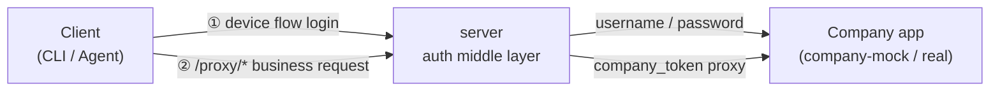

# auth-proxy

**English** · [中文](./README.zh-CN.md)

OAuth 2.0 device-flow authentication proxy. Issues RS256 JWTs and proxies requests to your company's apps — **company credentials never leave the proxy**. Clients only ever hold a JWT minted by the middle layer; the company token (`ct_*`) stays internal.



Two links: **① login** (device flow → client gets a JWT) and **② proxy** (business request → server forwards it on the company's behalf).

---

## Table of Contents

- [Architecture](#architecture)
- [Quick Start](#quick-start)
- [Admin Console](#admin-console)
- [Deployment](#deployment)
- [Operations](#operations)
- [Security Design](#security-design)
- [Development](#development)
- [Connecting the Real Company App](#connecting-the-real-company-app)
- [License](#license)

## Architecture

Monorepo managed with **pnpm workspaces + Turborepo**.

| Package | Responsibility | Port |
|---------|----------------|------|
| `packages/shared` | zod contracts + shared types | — |
| `packages/db` | DB schema (drizzle) + migrations + seed | — |
| `apps/company-mock` | Mock company app (`/login` `/refresh` `/me` `/api/orders`) | 4000 (internal) |
| `apps/server` | Auth middle layer: device flow + login page + JWT + gateway | 3000 (internal) |
| `apps/admin-web` | Admin console (Next.js) | 3001 (internal) |

**Database tables:** `signing_keys`, `apps`, `users`, `sessions`, `login_logs`, `api_logs`, `refresh_token_history`, `registration_tokens`, `admins`.

### Deployment topology

Only **nginx** is exposed on port 80; every other service lives on the internal network.

```
public :80 ──► nginx ──┬──► server:3000     (middle layer API + login page)
                       └──► admin-web:3001   (admin console, /admin)
server ──► postgres / redis / company-mock   (internal network only)
```

Full deployment diagrams and rationale: [docs/docker](./docs/docker/README.md).

## Quick Start

### Prerequisites

- **Node 22+**, **pnpm** (auto-enabled via corepack)
- **Postgres** and **Redis** (installed locally, or boot them with `docker compose up -d postgres redis`)

### Initialize

```bash
pnpm install

# Boot PG + Redis (skip if already running locally)
docker compose up -d postgres redis

# Create the database + run migrations + seed (generates RSA keys + first admin)
createdb auth-proxy
DATABASE_URL=postgres://localhost:5432/auth-proxy pnpm --filter @auth-proxy/db migrate
DATABASE_URL=postgres://localhost:5432/auth-proxy \
  ADMIN_USERNAME=admin ADMIN_PASSWORD=devpassword123 \
  pnpm --filter @auth-proxy/db seed

# Start mock + middle layer
DATABASE_URL=postgres://localhost:5432/auth-proxy \
REDIS_URL=redis://localhost:6379/2 \
COMPANY_API_BASE=http://localhost:4000 \
ADMIN_SESSION_SECRET=dev_secret_change_me_at_least_32_bytes_long \
  pnpm dev:all
```

The first admin account is created by the seed using `ADMIN_USERNAME` / `ADMIN_PASSWORD`. After logging into the console you can mint **registration tokens** to hand out to clients.

> **Note:** in production the seed creates **no** admin (zero defaults, no weak passwords). Create the first admin manually with `pnpm --filter @auth-proxy/db create-admin` or `docker compose exec server node packages/db/dist/scripts/create-admin.js`.

## Admin Console

Local: `http://localhost:3001/admin` · Production: `http://<server>/admin`

Features (username/password login + session-cookie auth):

- **Registration tokens** — create (time-limited, multi-use) / list (with usage counts) / revoke
- **Clients** — list all dynamically registered clients / revoke / restore
- **Audit log** — login attempts (success/failure + `[REUSE]` replay events) and API call records
- **Admins** — add / remove (you can't delete yourself)

## Deployment

**Daily deployments run through GitHub Actions CI/CD** (recommended):

- Push to `main` → [`.github/workflows/build.yml`](./.github/workflows/build.yml) builds the three images and pushes them to GHCR.
- Manually trigger [`.github/workflows/deploy.yml`](./.github/workflows/deploy.yml) to deploy (SSH to the server, pull the latest image, restart). Required Secrets: `DEPLOY_HOST` / `DEPLOY_USER` / `DEPLOY_SSH_KEY` (`DEPLOY_PORT` optional). Required input: `public_base_url`.

**Emergency manual deploy** (only when CI/CD is unavailable, e.g. GitHub outage):

```bash
PUBLIC_BASE_URL=http://<public-ip> SSH_HOST=<server-ip> ./deploy.sh
RESTART_ONLY=1 SSH_HOST=<server-ip> ./deploy.sh                              # just restart containers
FORCE_NEW_SECRETS=1 PUBLIC_BASE_URL=http://<public-ip> SSH_HOST=<server-ip> ./deploy.sh  # regenerate machine secrets
```

`deploy.sh` pre-builds artifacts locally (to avoid OOM on low-spec servers), uploads them, then the server only assembles runtime deps + copies artifacts (no compilation).

After deployment:

- Middle layer: `http://<server>/`
- Admin console: `http://<server>/admin/login`
- JWKS: `http://<server>/.well-known/jwks.json`

### Required environment variables

Production `.env` is generated automatically by `deploy.sh` on first deploy. Full reference: [`.env.example`](./.env.example).

| Variable | Description |
|----------|-------------|
| `DATABASE_URL` | Postgres connection string |
| `REDIS_URL` | Redis connection string (use an isolated db index, e.g. `/2`) |
| `ADMIN_SESSION_SECRET` | Admin session-cookie signing key (≥32 bytes; enforced in production) |
| `ADMIN_USERNAME` / `ADMIN_PASSWORD` | First admin credentials (seed creates them only when the table is empty) |
| `POSTGRES_PASSWORD` | Database password |
| `PUBLIC_BASE_URL` | Publicly reachable address used to build `verification_uri` (guards against host-header injection) |
| `COMPANY_API_BASE` | Company app base URL (change this to connect the real app) |

## Operations

`deploy.sh` auto-installs a cron (`/etc/cron.d/auth-proxy`):

- **Daily 03:00** — Postgres backup → `/opt/backups/postgres/` (14-day retention)
- **Every 5 min** — health check → fires a webhook on failure (30-min debounce)

```bash
# Manual backup / restore
/opt/auth-proxy/ops/backup.sh
/opt/auth-proxy/ops/restore.sh --list
/opt/auth-proxy/ops/restore.sh /opt/backups/postgres/auth-proxy_XXXXXXXX.sql

# Off-site backup + alerting (configured via .env)
REMOTE_BACKUP_CMD="rclone copyto {} oss:auth-proxy-backup/{/}"
ALERT_WEBHOOK=https://open.feishu.cn/open-apis/bot/v2/hook/xxx
```

Full ops guide (backup/restore, alerting, logs, migrations, troubleshooting): [docs/docker/05-ops](./docs/docker/05-ops.md).

## Security Design

- **Company token (`ct_*`) never leaves the middle layer** — clients only hold the proxy-minted JWT.
- **JWT RS256** — signing keys live in the `signing_keys` table and are rotatable; public key exposed at `/.well-known/jwks.json`.
- **`client_secret` stored scrypt-hashed**, never in plaintext.
- **CSRF protection** — double-submit cookie on `/verify/login`.
- **Refresh-token reuse detection** — reusing an old refresh token past `REFRESH_REUSE_GRACE_SEC` (30s) auto-revokes the session.
- **Rate limiting** — login/verify by IP, `/token` by client, `/proxy` by session.
- **Production config validation** — `assertProductionConfig()` rejects a weak `ADMIN_SESSION_SECRET` at startup.
- **First admin uses a strong random password** — seed never falls back to a weak default; `deploy.sh` generates a strong random value.

Details: [docs/docker/04-config-secrets](./docs/docker/04-config-secrets.md).

## Development

```bash
pnpm install      # install deps
pnpm dev:all      # start mock + server (local dev)
pnpm typecheck    # typecheck all packages
pnpm lint         # oxlint
pnpm build        # build all packages
```

Test accounts (mock):

| Account | Password | Permissions |
|---------|----------|-------------|
| alice | alice123 | `orders:read` |
| bob | bob123 | (none — for testing permission boundaries) |

## Connecting the Real Company App

When the real company app is available, **only touch the middle layer**:

1. Point `COMPANY_API_BASE` at the real company app.
2. If the login/refresh contract differs from the mock, edit [`apps/server/src/companyAuth.ts`](./apps/server/src/companyAuth.ts) — the only file in the middle layer that talks to the company app — and map the fields.

## License

[MIT](./LICENSE)
