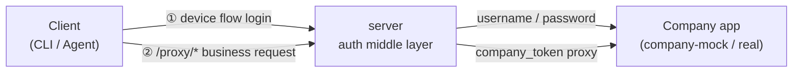
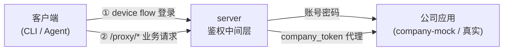

# auth-proxy

[English](#english) · [中文](#中文)

<a id="english"></a>

OAuth 2.0 device-flow authentication proxy. Issues RS256 JWTs and proxies requests to your company's apps — **company credentials never leave the proxy**. Clients only ever hold a JWT minted by the middle layer; the company token (`ct_*`) stays internal.



Two links: **① login** (device flow → client gets a JWT) and **② proxy** (business request → server forwards it on the company's behalf).

---

## Table of Contents

- [Architecture](#architecture)
- [Quick Start](#quick-start)
- [Admin Console](#admin-console)
- [Deployment](#deployment)
- [Operations](#operations)
- [Security Design](#security-design)
- [Development](#development)
- [Connecting the Real Company App](#connecting-the-real-company-app)
- [License](#license)

## Architecture

Monorepo managed with **pnpm workspaces + Turborepo**.

| Package | Responsibility | Port |
|---------|----------------|------|
| `packages/shared` | zod contracts + shared types | — |
| `packages/db` | DB schema (drizzle) + migrations + seed | — |
| `apps/company-mock` | Mock company app (`/login` `/refresh` `/me` `/api/orders`) | 4000 (internal) |
| `apps/server` | Auth middle layer: device flow + login page + JWT + gateway | 3000 (internal) |
| `apps/admin-web` | Admin console (Next.js) | 3001 (internal) |

**Database tables:** `signing_keys`, `apps`, `users`, `sessions`, `login_logs`, `api_logs`, `refresh_token_history`, `registration_tokens`, `admins`.

### Deployment topology

Only **nginx** is exposed on port 80; every other service lives on the internal network.

```
public :80 ──► nginx ──┬──► server:3000     (middle layer API + login page)
                       └──► admin-web:3001   (admin console, /admin)
server ──► postgres / redis / company-mock   (internal network only)
```

Full deployment diagrams and rationale: [docs/docker](./docs/docker/README.md).

## Quick Start

### Prerequisites

- **Node 22+**, **pnpm** (auto-enabled via corepack)
- **Postgres** and **Redis** (installed locally, or boot them with `docker compose up -d postgres redis`)

### Initialize

```bash
pnpm install

# Boot PG + Redis (skip if already running locally)
docker compose up -d postgres redis

# Create the database + run migrations + seed (generates RSA keys + first admin)
createdb auth-proxy
DATABASE_URL=postgres://localhost:5432/auth-proxy pnpm --filter @auth-proxy/db migrate
DATABASE_URL=postgres://localhost:5432/auth-proxy \
  ADMIN_USERNAME=admin ADMIN_PASSWORD=devpassword123 \
  pnpm --filter @auth-proxy/db seed

# Start mock + middle layer
DATABASE_URL=postgres://localhost:5432/auth-proxy \
REDIS_URL=redis://localhost:6379/2 \
COMPANY_API_BASE=http://localhost:4000 \
ADMIN_SESSION_SECRET=dev_secret_change_me_at_least_32_bytes_long \
  pnpm dev:all
```

The first admin account is created by the seed using `ADMIN_USERNAME` / `ADMIN_PASSWORD`. After logging into the console you can mint **registration tokens** to hand out to clients.

> **Note:** in production the seed creates **no** admin (zero defaults, no weak passwords). Create the first admin manually with `pnpm --filter @auth-proxy/db create-admin` or `docker compose exec server node packages/db/dist/scripts/create-admin.js`.

## Admin Console

Local: `http://localhost:3001/admin` · Production: `http://<server>/admin`

Features (username/password login + session-cookie auth):

- **Registration tokens** — create (time-limited, multi-use) / list (with usage counts) / revoke
- **Clients** — list all dynamically registered clients / revoke / restore
- **Audit log** — login attempts (success/failure + `[REUSE]` replay events) and API call records
- **Admins** — add / remove (you can't delete yourself)

## Deployment

**Daily deployments run through GitHub Actions CI/CD** (recommended):

- Push to `main` → [`.github/workflows/build.yml`](./.github/workflows/build.yml) builds the three images and pushes them to GHCR.
- Manually trigger [`.github/workflows/deploy.yml`](./.github/workflows/deploy.yml) to deploy (SSH to the server, pull the latest image, restart). Required Secrets: `DEPLOY_HOST` / `DEPLOY_USER` / `DEPLOY_SSH_KEY` (`DEPLOY_PORT` optional). Required input: `public_base_url`.

**Emergency manual deploy** (only when CI/CD is unavailable, e.g. GitHub outage):

```bash
PUBLIC_BASE_URL=http://<public-ip> SSH_HOST=<server-ip> ./deploy.sh
RESTART_ONLY=1 SSH_HOST=<server-ip> ./deploy.sh                              # just restart containers
FORCE_NEW_SECRETS=1 PUBLIC_BASE_URL=http://<public-ip> SSH_HOST=<server-ip> ./deploy.sh  # regenerate machine secrets
```

`deploy.sh` pre-builds artifacts locally (to avoid OOM on low-spec servers), uploads them, then the server only assembles runtime deps + copies artifacts (no compilation).

After deployment:

- Middle layer: `http://<server>/`
- Admin console: `http://<server>/admin/login`
- JWKS: `http://<server>/.well-known/jwks.json`

### Required environment variables

Production `.env` is generated automatically by `deploy.sh` on first deploy. Full reference: [`.env.example`](./.env.example).

| Variable | Description |
|----------|-------------|
| `DATABASE_URL` | Postgres connection string |
| `REDIS_URL` | Redis connection string (use an isolated db index, e.g. `/2`) |
| `ADMIN_SESSION_SECRET` | Admin session-cookie signing key (≥32 bytes; enforced in production) |
| `ADMIN_USERNAME` / `ADMIN_PASSWORD` | First admin credentials (seed creates them only when the table is empty) |
| `POSTGRES_PASSWORD` | Database password |
| `PUBLIC_BASE_URL` | Publicly reachable address used to build `verification_uri` (guards against host-header injection) |
| `COMPANY_API_BASE` | Company app base URL (change this to connect the real app) |

## Operations

`deploy.sh` auto-installs a cron (`/etc/cron.d/auth-proxy`):

- **Daily 03:00** — Postgres backup → `/opt/backups/postgres/` (14-day retention)
- **Every 5 min** — health check → fires a webhook on failure (30-min debounce)

```bash
# Manual backup / restore
/opt/auth-proxy/ops/backup.sh
/opt/auth-proxy/ops/restore.sh --list
/opt/auth-proxy/ops/restore.sh /opt/backups/postgres/auth-proxy_XXXXXXXX.sql

# Off-site backup + alerting (configured via .env)
REMOTE_BACKUP_CMD="rclone copyto {} oss:auth-proxy-backup/{/}"
ALERT_WEBHOOK=https://open.feishu.cn/open-apis/bot/v2/hook/xxx
```

Full ops guide (backup/restore, alerting, logs, migrations, troubleshooting): [docs/docker/05-ops](./docs/docker/05-ops.md).

## Security Design

- **Company token (`ct_*`) never leaves the middle layer** — clients only hold the proxy-minted JWT.
- **JWT RS256** — signing keys live in the `signing_keys` table and are rotatable; public key exposed at `/.well-known/jwks.json`.
- **`client_secret` stored scrypt-hashed**, never in plaintext.
- **CSRF protection** — double-submit cookie on `/verify/login`.
- **Refresh-token reuse detection** — reusing an old refresh token past `REFRESH_REUSE_GRACE_SEC` (30s) auto-revokes the session.
- **Rate limiting** — login/verify by IP, `/token` by client, `/proxy` by session.
- **Production config validation** — `assertProductionConfig()` rejects a weak `ADMIN_SESSION_SECRET` at startup.
- **First admin uses a strong random password** — seed never falls back to a weak default; `deploy.sh` generates a strong random value.

Details: [docs/docker/04-config-secrets](./docs/docker/04-config-secrets.md).

## Development

```bash
pnpm install      # install deps
pnpm dev:all      # start mock + server (local dev)
pnpm typecheck    # typecheck all packages
pnpm lint         # oxlint
pnpm build        # build all packages
```

Test accounts (mock):

| Account | Password | Permissions |
|---------|----------|-------------|
| alice | alice123 | `orders:read` |
| bob | bob123 | (none — for testing permission boundaries) |

## Connecting the Real Company App

When the real company app is available, **only touch the middle layer**:

1. Point `COMPANY_API_BASE` at the real company app.
2. If the login/refresh contract differs from the mock, edit [`apps/server/src/companyAuth.ts`](./apps/server/src/companyAuth.ts) — the only file in the middle layer that talks to the company app — and map the fields.

## License

[MIT](./LICENSE)

---

<a id="中文"></a>

# auth-proxy(中文)

OAuth 2.0 设备授权流程鉴权中间层。签发 RS256 JWT 并代理转发到公司应用 —— **公司凭证永不离开中间层**。客户端只持有中间层签发的 JWT,公司 token(`ct_*`)始终留在内部。



两条链路:**① 登录**(设备流程,客户端拿 JWT);**② 代理**(业务请求,server 代持公司 token 转发)。

---

## 目录

- [架构](#架构)
- [快速开始](#快速开始)
- [Admin 后台](#admin-后台)
- [部署](#部署)
- [运维](#运维)
- [安全设计](#安全设计)
- [开发](#开发)
- [真实公司应用接入](#真实公司应用接入)
- [License](#license-1)

## 架构

基于 **pnpm workspaces + Turborepo** 的 monorepo。

| 包 | 作用 | 端口 |
|----|------|------|
| `packages/shared` | zod 契约 + 类型(各包共享) | — |
| `packages/db` | 数据库 schema(drizzle)+ 迁移 + 种子 | — |
| `apps/company-mock` | mock 公司应用(`/login` `/refresh` `/me` `/api/orders`) | 4000(内部) |
| `apps/server` | 鉴权中间层:device flow + 登录页 + JWT + gateway | 3000(内部) |
| `apps/admin-web` | Admin 管理后台(Next.js) | 3001(内部) |

**数据库表:** `signing_keys`、`apps`、`users`、`sessions`、`login_logs`、`api_logs`、`refresh_token_history`、`registration_tokens`、`admins`。

### 部署拓扑

只有 **nginx** 暴露 80 端口,其余服务全部在内部网络可见。

```
公网 :80 ──► nginx ──┬──► server:3000   (中间层 API + 登录页)
                    └──► admin-web:3001 (后台页面,/admin)
server ──► postgres / redis / company-mock(均为内部网络)
```

完整部署图与决策说明:[docs/docker](./docs/docker/README.md)。

## 快速开始

### 前置

- **Node 22+**、**pnpm**(corepack 自动启用)
- **Postgres**、**Redis**(本机已装,或用 `docker compose up -d postgres redis` 起这两个)

### 初始化

```bash
pnpm install

# 起 PG + Redis(本机已有则跳过)
docker compose up -d postgres redis

# 建库 + 迁移 + 种子(生成 RSA 密钥 + 首个管理员)
createdb auth-proxy
DATABASE_URL=postgres://localhost:5432/auth-proxy pnpm --filter @auth-proxy/db migrate
DATABASE_URL=postgres://localhost:5432/auth-proxy \
  ADMIN_USERNAME=admin ADMIN_PASSWORD=devpassword123 \
  pnpm --filter @auth-proxy/db seed

# 起 mock + 中间层
DATABASE_URL=postgres://localhost:5432/auth-proxy \
REDIS_URL=redis://localhost:6379/2 \
COMPANY_API_BASE=http://localhost:4000 \
ADMIN_SESSION_SECRET=dev_secret_change_me_at_least_32_bytes_long \
  pnpm dev:all
```

首个管理员账号由 seed 用 `ADMIN_USERNAME` / `ADMIN_PASSWORD` 创建。登录后台后可创建**注册令牌**发给客户端。

> **注意:**生产环境 seed **不创建任何 admin**(零默认,防弱口令)。首个管理员手动创建:`pnpm --filter @auth-proxy/db create-admin` 或 `docker compose exec server node packages/db/dist/scripts/create-admin.js`。

## Admin 后台

本地:`http://localhost:3001/admin` · 生产:`http://<server>/admin`

功能(账号密码登录 + session cookie 鉴权):

- **注册令牌**:创建(限时多次)/ 列出(含使用次数)/ 吊销
- **客户端**:列出所有动态注册的 client / 吊销 / 恢复
- **审计日志**:登录记录(成功/失败 + `[REUSE]` 重用事件)+ API 调用记录
- **管理员**:添加 / 删除(不能删自己)

## 部署

**日常部署走 GitHub Actions CI/CD**(推荐):

- push 到 `main` → [`.github/workflows/build.yml`](./.github/workflows/build.yml) 自动构建三个镜像推 GHCR。
- 手动触发 [`.github/workflows/deploy.yml`](./.github/workflows/deploy.yml) 部署(SSH 到服务器拉最新镜像并重启)。需要配 Secrets:`DEPLOY_HOST` / `DEPLOY_USER` / `DEPLOY_SSH_KEY`(`DEPLOY_PORT` 可选)。必填 input:`public_base_url`。

**应急手动部署**(仅在 CI/CD 不可用时使用,如 GitHub 故障):

```bash
PUBLIC_BASE_URL=http://公网IP SSH_HOST=服务器IP ./deploy.sh
RESTART_ONLY=1 SSH_HOST=服务器IP ./deploy.sh                              # 仅重启容器
FORCE_NEW_SECRETS=1 PUBLIC_BASE_URL=http://公网IP SSH_HOST=服务器IP ./deploy.sh  # 强制重新生成机器密钥
```

`deploy.sh` 先在本地预构建产物(避免低配服务器编译卡死),上传后服务器只装运行时依赖 + 拷产物(不跑编译)。

部署后:

- 中间层:`http://<server>/`
- Admin 后台:`http://<server>/admin/login`
- JWKS:`http://<server>/.well-known/jwks.json`

### 必需的环境变量

生产 `.env` 由 `deploy.sh` 首次部署自动生成,完整说明见 [`.env.example`](./.env.example)。

| 变量 | 说明 |
|------|------|
| `DATABASE_URL` | Postgres 连接串 |
| `REDIS_URL` | Redis 连接串(建议独立 db index,如 `/2`) |
| `ADMIN_SESSION_SECRET` | 后台 session cookie 签名密钥(≥32 字节,生产强制) |
| `ADMIN_USERNAME` / `ADMIN_PASSWORD` | 首个管理员凭证(seed 仅在表空时创建一次) |
| `POSTGRES_PASSWORD` | 数据库密码 |
| `PUBLIC_BASE_URL` | 对外可访问地址(拼 `verification_uri`,防 host header 注入) |
| `COMPANY_API_BASE` | 公司应用基址(真实接入改这里) |

## 运维

`deploy.sh` 自动安装 cron(`/etc/cron.d/auth-proxy`):

- **每天 03:00** PG 备份 → `/opt/backups/postgres/`(保留 14 天)
- **每 5 分钟** 健康巡检 → 异常时调 webhook 告警(30 分钟去抖)

```bash
# 手动备份 / 恢复
/opt/auth-proxy/ops/backup.sh
/opt/auth-proxy/ops/restore.sh --list
/opt/auth-proxy/ops/restore.sh /opt/backups/postgres/auth-proxy_XXXXXXXX.sql

# 异地备份 + 告警(在 .env 配)
REMOTE_BACKUP_CMD="rclone copyto {} oss:auth-proxy-backup/{/}"
ALERT_WEBHOOK=https://open.feishu.cn/open-apis/bot/v2/hook/xxx
```

完整运维指南(备份恢复、故障告警、日志、迁移、故障排查):[docs/docker/05-ops](./docs/docker/05-ops.md)。

## 安全设计

- **公司 token(`ct_*`)永不离开中间层** — 客户端只持有中间层签发的 JWT。
- **JWT RS256** — 签名密钥存 `signing_keys` 表,可轮转;公钥经 `/.well-known/jwks.json` 暴露。
- **`client_secret` scrypt 哈希存储**,非明文。
- **CSRF 防护** — `/verify/login` 双重提交 cookie。
- **Refresh 重用检测** — 旧 refresh 超 `REFRESH_REUSE_GRACE_SEC`(30s)再用 → 自动吊销 session。
- **限流** — login/verify 按 IP,`/token` 按 client,`/proxy` 按 session。
- **生产配置校验** — `assertProductionConfig()` 启动时拒绝弱 `ADMIN_SESSION_SECRET`。
- **首个管理员强制随机密码** — seed 不回退弱默认,由 `deploy.sh` 生成强随机值。

详见 [docs/docker/04-config-secrets](./docs/docker/04-config-secrets.md)。

## 开发

```bash
pnpm install      # 装依赖
pnpm dev:all      # 起 mock + server(本地开发)
pnpm typecheck    # 全量类型检查
pnpm lint         # oxlint
pnpm build        # 全量构建
```

测试账号(mock):

| 账号 | 密码 | 权限 |
|------|------|------|
| alice | alice123 | `orders:read` |
| bob | bob123 | (无,测权限边界) |

## 真实公司应用接入

真实公司应用可用时,**只改中间层**:

1. `COMPANY_API_BASE` 指向真实公司应用。
2. 若登录/刷新接口契约与 mock 不同,改 [`apps/server/src/companyAuth.ts`](./apps/server/src/companyAuth.ts)(中间层唯一接触公司应用的文件),做字段映射。

## License

[MIT](./LICENSE)
